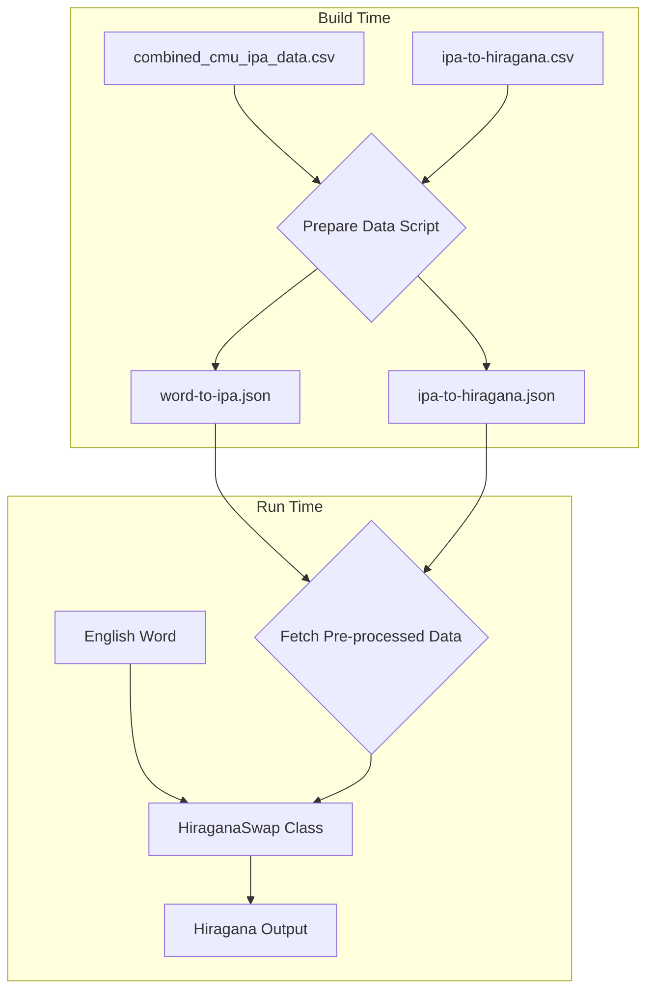

# HiraganaSwap Implementation Plan (Revised)

## Overview
Implement the HiraganaSwap class to convert English words to Hiragana using IPA as an intermediate representation. This plan optimizes for performance within a browser extension context by pre-processing data during a build step.

## Architecture

### Data Flow


### Key Components

1.  **HiraganaSwap Class** (`/utils/phonetic-swap.ts`)
    - Implements `IPhoneticSwap` interface.
    - Manages loading and caching of **pre-processed JSON data**.
    - Performs the conversion pipeline.

2.  **Data Sources (Optimized)**
    - **Source CSVs:**
        - `/scripts/combined_cmu_ipa_data.csv`
        - `/components/ipa-to-hiragana.csv`
    - **Build-Time Script:**
        - A new script, `/scripts/prepare-data.ts`, will parse the source CSVs.
    - **Public Data Assets (Generated):**
        - `/public/data/word-to-ipa.json`
        - `/public/data/ipa-to-hiragana.json`

3.  **Utility: IPA Parser**
    - Parses IPA strings into individual phonemes using a longest-match-first algorithm.
    - Manages IPA diacritics and stress markers.

## Implementation Details

### 1. Data Pre-processing (Build Step)

Create a new script at `/scripts/prepare-data.ts`. This script will:
1.  **Add a CSV parsing library** (e.g., `papaparse` or `csv-parse`) to `devDependencies`.
2.  Read `/scripts/combined_cmu_ipa_data.csv` and generate `/public/data/word-to-ipa.json`.
    - **JSON Structure:** To keep file size minimal, use a compact array of arrays: `[ [word: string, ipa_pronunciations: string[]], ... ]`.
    - **Example:** `[ ["HELLO", ["həˈloʊ", "hɛˈloʊ"]], ["WORLD", ["wɝld"]] ]`
3.  Read `/components/ipa-to-hiragana.csv` and generate `/public/data/ipa-to-hiragana.json`.
    - **JSON Structure:** `Map<string, { hiragana: string, score: number }>` (e.g., `{ "oʊ": { "hiragana": "おう", "score": 0.9 } }`)
4.  Integrate this script into the build process by adding it to the `package.json` `scripts`:
    ```json
    "scripts": {
      "prepare-data": "tsx scripts/prepare-data.ts",
      "build": "npm run prepare-data && wxt build",
      // ... other scripts
    }
    ```

### 2. Data Structures (in `HiraganaSwap`)

The class will fetch and cache the generated JSON data.

```typescript
// Static cache for pre-processed data
private static wordToIpaMap: Map<string, string[]> = new Map();
private static ipaToHiraganaMap: Map<string, { hiragana: string, score: number }> = new Map();
private static ipaPhonemeInventory: string[] = []; // For the parser
private static isInitialized: boolean = false;

// The `initialize` method will kick off the async loading,
// managed by a static promise.
private static initPromise: Promise<void> | null = null;

// In initialize():
if (!HiraganaSwap.initPromise) {
    HiraganaSwap.initPromise = this.loadData(); // loadData is async
}

// The swap() and canSwap() methods will await this promise:
async canSwap(input: string): Promise<boolean> {
    await HiraganaSwap.initPromise;
    // ... logic continues
}
```

### 3. IPA Phoneme Parser

The parser will use the `ipaToHiraganaMap` to define its phoneme inventory.

- **Phoneme Inventory**: On initialization, create a sorted list of all keys from `ipaToHiraganaMap`. Sort by length, descending. This is crucial for the longest-match algorithm.
  ```typescript
  this.ipaPhonemeInventory = [...this.ipaToHiraganaMap.keys()].sort((a, b) => b.length - a.length);
  ```
- **Algorithm**:
  1.  Take an IPA string as input (e.g., "həˈloʊ").
  2.  First, strip irrelevant characters like stress markers (ˈ, ˌ).
  3.  Iterate through the `ipaPhonemeInventory`.
  4.  For each phoneme in the inventory, check if the current IPA string `startsWith()` it.
  5.  If it does, that's a match. Add the phoneme to the results, and slice it from the start of the IPA string. Repeat until the string is empty.

### 4. Conversion Algorithm & Scoring

```
1. Normalize input word (uppercase for dictionary lookup).
2. Look up word in `wordToIpaMap`. If not found, `canSwap()` is false.
3. For each IPA pronunciation found:
   a. Parse the IPA string into a list of phonemes using the IPA Parser utility.
   b. Map each phoneme to its Hiragana equivalent and score using `ipaToHiraganaMap`.
   c. If any phoneme cannot be mapped, discard this pronunciation.
   d. Calculate the **cumulative score** for the pronunciation by summing the scores of all its mapped phonemes.
4. Select the pronunciation with the highest **cumulative score**.
5. Return the resulting Hiragana string, wrapped in HTML.
```

### 5. Error Handling & Edge Cases

- **Word not found**: `canSwap()` returns `false`.
- **Unmappable phonemes**: The entire pronunciation is considered invalid. If all pronunciations for a word are invalid, `canSwap()` returns `false`.
- **Data file not found**: Log an error during initialization and disable the swapper.
- **Compound/hyphenated words**: Treat as-is. If "cat-food" isn't in the dictionary, it won't be swapped. Future enhancement could be to split and look up parts.

## Implementation Steps

### Phase 1: Data Preparation
1.  Choose and add a CSV parsing library to `devDependencies`.
2.  Create the `/scripts/prepare-data.ts` script.
3.  Implement the logic to parse both CSVs and write the corresponding JSON files to `/public/data/`.
4.  Update `package.json` to run this script before the `build` command.
5.  Move the source CSVs to more appropriate locations (`/data/sources/` perhaps, or keep as-is) and update `.gitignore` if necessary.

### Phase 2: Data Loading
1.  Update the `HiraganaSwap.initialize()` method to `fetch` the new JSON files.
2.  Populate `wordToIpaMap` and `ipaToHiraganaMap`.
3.  Create and populate the `ipaPhonemeInventory` by sorting the keys of the `ipaToHiraganaMap`.

### Phase 3: IPA Parser Utility
1.  Implement the longest-match-first parsing algorithm using the `ipaPhonemeInventory`.
2.  Handle stripping of diacritics/modifiers.
3.  Add unit tests for the parser.

### Phase 4: Core Conversion Logic
1.  Implement the main `swap()` and `canSwap()` methods.
2.  Use the refined scoring logic (average score) to select the best pronunciation.

### Phase 5: Integration & Testing
1.  Ensure the `hiragana-text` CSS class is applied.
2.  Perform integration tests with various English words, including those with multiple pronunciations and edge cases.

## Architectural Changes for Asynchronous Loading

To accommodate fetching data without blocking, the following changes must be made to the existing synchronous structure:

1.  **Update `IPhoneticSwap` Interface**: The `canSwap` and `swap` methods must be made asynchronous to await data loading.
    ```typescript
    // utils/phonetic-swap.ts
    export interface IPhoneticSwap {
        // ...
        canSwap: (input: string) => Promise<boolean>;
        swap: (input: string, options?: any) => Promise<string | null>;
    }
    ```

2.  **Implement Initialization Promise in `HiraganaSwap`**: This class will manage its own asynchronous initialization, triggered by the synchronous `initialize()` call from the factory.
    ```typescript
    // utils/phonetic-swap.ts in HiraganaSwap
    private static initPromise: Promise<void> | null = null;

    initialize(): void {
        if (!HiraganaSwap.initPromise) {
            HiraganaSwap.initPromise = this.loadData(); // loadData is async
        }
    }

    async canSwap(input: string): Promise<boolean> {
        await HiraganaSwap.initPromise;
        // ... logic
    }
    ```

3.  **Update Synchronous Swappers**: All other swapper classes (`MorseCodeSwap`, `BrailleSwap`, etc.) must have their `canSwap` and `swap` methods updated with the `async` keyword to conform to the updated interface. This is a non-breaking change for their internal logic.
    ```typescript
    // Example for MorseCodeSwap
    async canSwap(input: string): Promise<boolean> {
        return /^[a-zA-Z]+$/.test(input);
    }
    ```

4.  **Confirm `background.ts` Compatibility**: The `onMessage` handlers in the background script already support `Promise`-based return values, so no changes are needed there. They will correctly `await` the results from the now-asynchronous `canSwap` and `swap` calls.

## Success Criteria
1.  Accurate conversion of common English words to Hiragana.
2.  **Fast initial load time** due to pre-processed data.
3.  Graceful handling of unmappable words.
4.  Comprehensive test coverage for the parser and conversion logic.