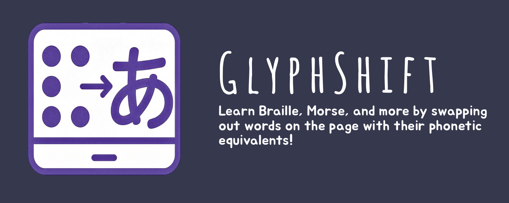
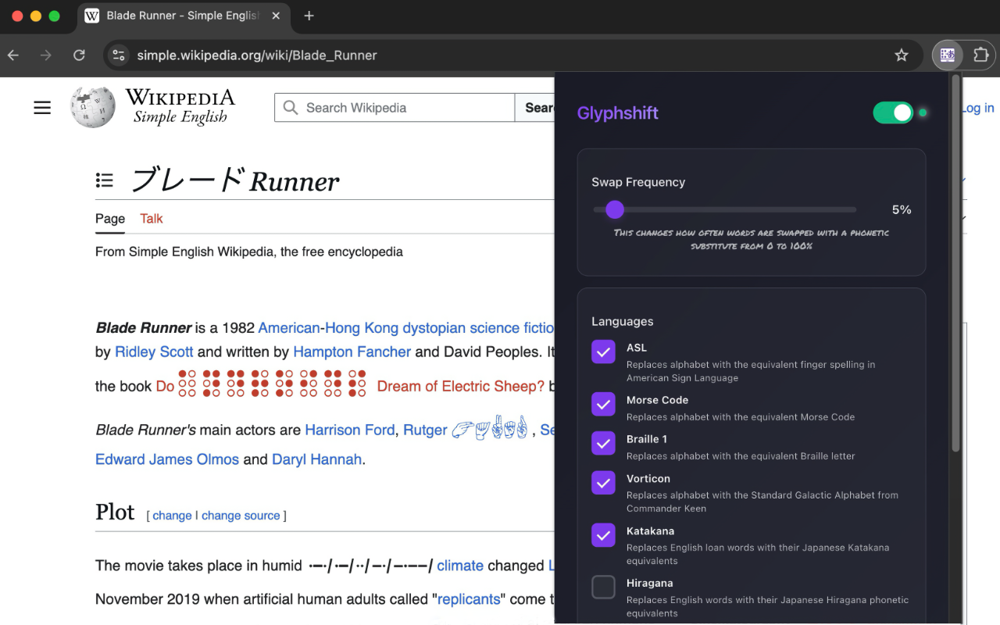
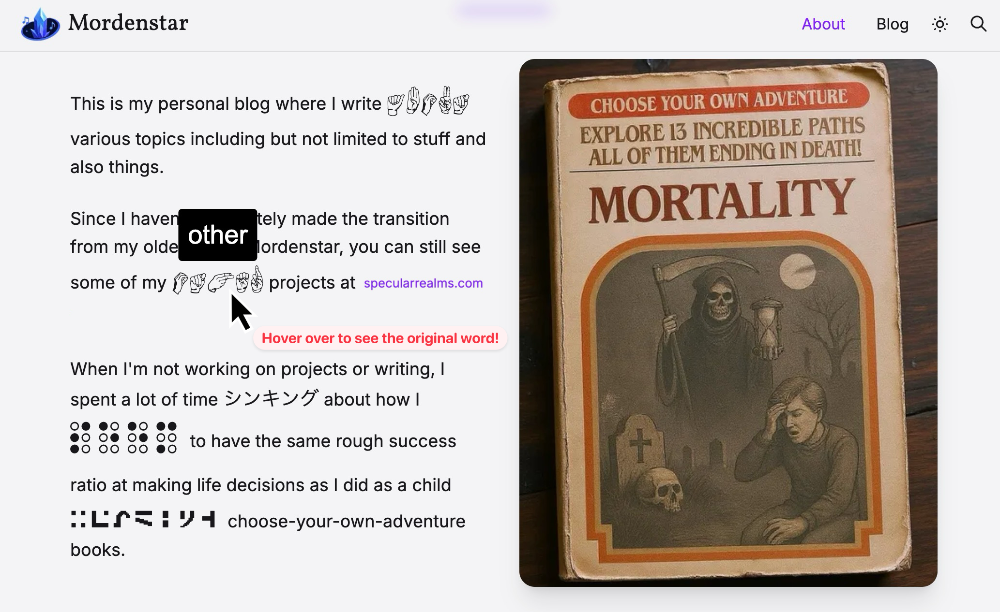

# Glyphshift

**Transform text on web pages into different writing systems like Hiragana, Braille, and Morse Code to help you learn and practice reading these alphabets.**

Glyphshift is a browser extension that randomly replaces words with their phonetic or symbolic equivalents based on user-selected writing systems and frequency settings, creating an immersive learning experience while browsing the web.

## Screenshots

  
  

## Why Glyphshift?

Does one of the following describe you?

- Want to learn a new writing system through immersion?
- Fancy yourself the one true polyglot?
- Want to make your browser look like a set piece from Blade Runner?
- Looking for a fun way to practice Braille, Morse Code, or other alphabets?

## Key Features

- 🌐 Works on any website
- 📚 Support for multiple writing systems: ASL fingerspelling, Morse Code, Braille, Hiragana, Katakana, etc.
- 🎛️ Adjustable swap frequency (0-100%)
- 💾 Saves your preferences across browser sessions
- 🔒 Privacy-focused: all processing happens locally, no data collection

## Installation

### From Extension Stores
Glyphshift is available on the Chrome Web Store. [Install it here](#) *(link coming soon)*

### Manual Installation

If you prefer to install the extension manually or want to use the latest development version:

#### For Chrome/Edge/Brave:
1. Download the latest `glyphshift-*-chrome.zip` from the [Releases page](https://github.com/scpedicini/glyph-shift/releases)
2. Extract the zip file to a folder on your computer
3. Open your browser and navigate to the extensions page:
   - Chrome: `chrome://extensions`
   - Edge: `edge://extensions`
   - Brave: `brave://extensions`
4. Enable "Developer mode" (toggle in the top right)
5. Click "Load unpacked" and select the extracted folder
6. The extension is now installed and ready to use

#### For Firefox:
1. Download the latest `glyphshift-*-firefox.zip` from the [Releases page](https://github.com/scpedicini/glyph-shift/releases)
2. Open Firefox and navigate to `about:debugging`
3. Click "This Firefox" in the left sidebar
4. Click "Load Temporary Add-on"
5. Select the downloaded zip file
6. The extension is now installed (Note: In Firefox, manually loaded extensions are temporary and will be removed when Firefox restarts. For permanent installation, the extension needs to be signed by Mozilla)

#### Building from Source:
If you want to build the extension yourself:
1. Clone this repository
2. Install dependencies: `npm install`
3. Build the extension:
   - For Chrome: `npm run build`
   - For Firefox: `npm run build:firefox`
4. The built extension will be in the `.output/chrome-mv3` or `.output/firefox-mv2` directory
5. Follow the manual installation steps above using the built directory

# FAQ

## How is Glyphshift different from other language learning tools?

Unlike many other swap-based extensions, Glyphshift focuses on phonetic and symbolic systems (such as Morse code or ASL fingerspelling) rather than full languages (such as Spanish or German) - making it significantly easier to use and more accessible for quick learning and practice.

## Prior Art

Language Immersion
https://github.com/google/chrome-language-immersion

Polyglot
https://code.google.com/archive/p/chrome-polyglot/

MindTheWord
https://chromewebstore.google.com/detail/mind-the-word/fabjlaokbhaoehejcoblhahcekmogbom?hl=en

Unlike the other extensions which focus more on language translation, Glyphshift focuses more on learning "writing systems" or "alphabets". These methods of communication are relatively simple and can usually be learned in a few hours. This extension is meant to be a fun way to review your knowledge of these alphabets.

# Attributions

## Morse Code Font
- **Font:** Morso Kode Font
- **Designer:** Morten L T
- **Source:** https://www.fontspace.com/morso-kode-font-f7440
- **License:** 100% Freeware

## ASL Fingerspelling Font
- **Font:** ASL Hands by Frank
- **Designer:** Frank Gemignani
- **Source:** https://www.dafont.com/asl-hands-by-frank.font
- **License:** 100% Freeware

# Development

## TODO

- [ ] Reference to learning resources
- [X] Vorticon alphabet

## Future Language Support

- [ ] Braille 2, aka contracted Grade 2 braille
- [X] Support for numerals in swap systems
- [ ] Cockney rhyming slang should incorporate English synonyms, base forms, etc. to make it more flexible

## Data Preparation

The extension requires pre-processed data files for various phonetic systems. If you modify the source CSV/TSV files, you must regenerate the JSON data files.

## Available Scripts

- `npm run prepare-data` - Run all data preparation scripts
- `npm run prepare-data:hiragana` - Prepare Hiragana phonetic data
- `npm run prepare-data:katakana` - Prepare Katakana loan words data
- `npm run prepare-data:cockney` - Prepare Cockney rhyming slang data

## Data Sources

### Hiragana Data
- Source files:
  - `/data-sources/combined_cmu_ipa_data.csv` - English word to IPA pronunciation mappings
  - `/data-sources/ipa-to-hiragana.csv` - IPA phoneme to Hiragana mappings
- Output: 
  - `/public/data/hiragana-word-to-ipa.json`
  - `/public/data/hiragana-ipa-to-hiragana.json`

### Katakana Data
- Source file: `/data-sources/katakana_loan_words.tsv` - Japanese loan words
- Output: `/public/data/katakana-loan-words.json`

### Cockney Rhyming Slang Data
- Source file: `/data-sources/cockney-rhyming-slang.csv` - Cockney rhyming slang mappings
- Features:
  - Supports multiple rhymes for the same word
  - Handles synonyms (comma-delimited in the Synonyms column)
  - Preserves all metadata (English, Rhyme, Cockney, Notes, Synonyms)
- Output: `/public/data/cockney-rhyming-slang.json`

**Note:** The data preparation scripts are NOT run automatically during builds. You must run them manually after any CSV/TSV modifications.