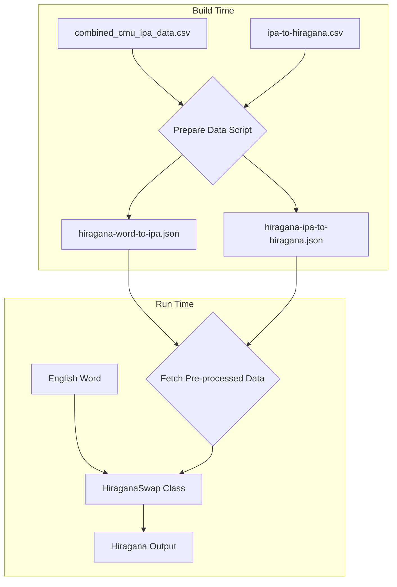

# HiraganaSwap Implementation Plan (Revised)

## Overview
Implement the HiraganaSwap class to convert English words to Hiragana using IPA as an intermediate representation. This plan optimizes for performance within a browser extension context by pre-processing data during a build step.

## Architecture

### Data Flow


### Key Components

1.  **HiraganaSwap Class** (`/utils/phonetic-swap.ts`)
    - Implements `IPhoneticSwap` interface.
    - Manages loading and caching of **pre-processed JSON data**.
    - Performs the conversion pipeline.

2.  **Data Sources (Optimized)**
    - **Source CSVs:** (can be located anywhere in the project)
        - `/scripts/combined_cmu_ipa_data.csv`
        - `/components/ipa-to-hiragana.csv`
    - **Build-Time Script:**
        - A new script, `/scripts/prepare-data.ts`, will parse the source CSVs using `papaparse`.
    - **Public Data Assets (Generated):**
        - `/public/data/hiragana-word-to-ipa.json`
        - `/public/data/hiragana-ipa-to-hiragana.json`

3.  **Utility: IPA Parser**
    - Parses IPA strings into individual phonemes using a longest-match-first algorithm.
    - Manages IPA diacritics and stress markers.

## Implementation Details

### 1. Data Pre-processing (Build Step)

Create a new script at `/scripts/prepare-data.ts`. This script will:
1.  **Add `papaparse`** to `devDependencies` for CSV parsing.
2.  Read `/scripts/combined_cmu_ipa_data.csv` and generate `/public/data/hiragana-word-to-ipa.json`.
    - **JSON Structure:** To keep file size minimal, use a compact array of arrays: `[ [word: string, ipa_pronunciations: string[]], ... ]`.
    - **Example:** `[ ["HELLO", ["həˈloʊ", "hɛˈloʊ"]], ["WORLD", ["wɝld"]] ]`
3.  Read `/components/ipa-to-hiragana.csv` and generate `/public/data/hiragana-ipa-to-hiragana.json`.
    - **JSON Structure:** `Map<string, { hiragana: string, score: number }>` (e.g., `{ "oʊ": { "hiragana": "おう", "score": 0.9 } }`)
4.  **Manual execution only** - Add the script to `package.json` but do NOT integrate into automatic builds:
    ```json
    "scripts": {
      "prepare-data": "tsx scripts/prepare-data.ts",
      // ... other scripts (do NOT add to build script)
    }
    ```
    - Document in README.md that `npm run prepare-data` must be run manually after modifying CSV files.

### 2. Data Structures (in `HiraganaSwap`)

The class will fetch and cache the generated JSON data.

```typescript
// Static cache for pre-processed data
private static wordToIpaMap: Map<string, string[]> = new Map();
private static ipaToHiraganaMap: Map<string, { hiragana: string, score: number }> = new Map();
private static ipaPhonemeInventory: string[] = []; // For the parser
private static isInitialized: boolean = false;

// The `initialize` method will kick off the async loading,
// managed by a static promise.
private static initPromise: Promise<void> | null = null;

// In initialize():
if (!HiraganaSwap.initPromise) {
    HiraganaSwap.initPromise = this.loadData(); // loadData is async
}

// The swap() and canSwap() methods will await this promise:
async canSwap(input: string): Promise<boolean> {
    await HiraganaSwap.initPromise;
    // ... logic continues
}
```

### 3. IPA Phoneme Parser

The parser will use the `ipaToHiraganaMap` to define its phoneme inventory.

- **Phoneme Inventory**: On initialization, create a sorted list of all keys from `ipaToHiraganaMap`. Sort by length, descending. This is crucial for the longest-match algorithm.
  ```typescript
  this.ipaPhonemeInventory = [...this.ipaToHiraganaMap.keys()].sort((a, b) => b.length - a.length);
  ```
- **Algorithm**:
  1.  Take an IPA string as input (e.g., "həˈloʊ").
  2.  First, strip irrelevant characters like stress markers (ˈ, ˌ).
  3.  Iterate through the `ipaPhonemeInventory`.
  4.  For each phoneme in the inventory, check if the current IPA string `startsWith()` it.
  5.  If it does, that's a match. Add the phoneme to the results, and slice it from the start of the IPA string. Repeat until the string is empty.

### 4. Conversion Algorithm & Scoring

```
1. Normalize input word (uppercase for dictionary lookup).
2. Look up word in `wordToIpaMap`. If not found, `canSwap()` is false.
3. For each IPA pronunciation found:
   a. Parse the IPA string into a list of phonemes using the IPA Parser utility.
   b. Map each phoneme to its Hiragana equivalent and score using `ipaToHiraganaMap`.
   c. If any phoneme cannot be mapped, discard this pronunciation.
   d. Calculate the **cumulative score** for the pronunciation by summing the scores of all its mapped phonemes.
4. Select the pronunciation with the highest **cumulative score**.
5. Return the resulting Hiragana string, wrapped in HTML.
```

### 5. Error Handling & Edge Cases

- **Word not found**: `canSwap()` returns `false`.
- **Unmappable phonemes**: The entire pronunciation is considered invalid. If all pronunciations for a word are invalid, `canSwap()` returns `false`.
- **Data file not found**: Log error to console (console.error) during initialization and disable the swapper by having `canSwap()` always return `false`.
- **Async method failures**: If data loading fails, log error to console and return `false` from `canSwap()` or `null` from `swap()`.
- **Compound/hyphenated words**: Treat as-is. If "cat-food" isn't in the dictionary, it won't be swapped. Future enhancement could be to split and look up parts.

## Implementation Steps

### Phase 1: Data Preparation
1.  Add `papaparse` to `devDependencies`.
2.  Create the `/scripts/prepare-data.ts` script.
3.  Implement the logic to parse both CSVs and write the corresponding JSON files to `/public/data/`.
4.  Add `prepare-data` script to `package.json` (manual execution only).
5.  Update README.md to document that `npm run prepare-data` must be run manually after CSV modifications.
6.  CSV files can remain in current locations or be moved as needed.

### Phase 2: Data Loading
1.  Update the `HiraganaSwap.initialize()` method to `fetch` the new JSON files.
2.  Populate `wordToIpaMap` and `ipaToHiraganaMap`.
3.  Create and populate the `ipaPhonemeInventory` by sorting the keys of the `ipaToHiraganaMap`.

### Phase 3: IPA Parser Utility
1.  Implement the longest-match-first parsing algorithm using the `ipaPhonemeInventory`.
2.  Handle stripping of diacritics/modifiers.
3.  Create `tests/hiragana.test.ts` with unit tests for the parser.
4.  Add tests progressively as each component is built.

### Phase 4: Core Conversion Logic
1.  Implement the main `swap()` and `canSwap()` methods.
2.  Use the refined scoring logic (average score) to select the best pronunciation.

### Phase 5: Integration & Testing
1.  **Update ALL swap classes to async** - Convert `canSwap` and `swap` methods in all classes to async/Promise-based.
2.  Create `tests/general.test.ts` to test the async interface changes across all swap classes.
3.  Ensure the `hiragana-text` CSS class is applied.
4.  Perform integration tests with various English words, including those with multiple pronunciations and edge cases.
5.  Verify the entire extension still works after making all swap methods async.
6.  Add comprehensive test coverage for edge cases in `tests/hiragana.test.ts`.

## Architectural Changes for Asynchronous Loading

To accommodate fetching data without blocking, the following changes must be made to the existing synchronous structure:

1.  **Update `IPhoneticSwap` Interface**: The `canSwap` and `swap` methods must be made asynchronous to await data loading.
    ```typescript
    // utils/phonetic-swap.ts
    export interface IPhoneticSwap {
        // ...
        canSwap: (input: string) => Promise<boolean>;
        swap: (input: string, options?: any) => Promise<string | null>;
    }
    ```

2.  **Implement Initialization Promise in `HiraganaSwap`**: This class will manage its own asynchronous initialization, triggered by the synchronous `initialize()` call from the factory.
    ```typescript
    // utils/phonetic-swap.ts in HiraganaSwap
    private static initPromise: Promise<void> | null = null;

    initialize(): void {
        if (!HiraganaSwap.initPromise) {
            HiraganaSwap.initPromise = this.loadData(); // loadData is async
        }
    }

    async canSwap(input: string): Promise<boolean> {
        await HiraganaSwap.initPromise;
        // ... logic
    }
    ```

3.  **Update ALL Synchronous Swappers** (REQUIRED): Every swapper class (`MorseCodeSwap`, `BrailleSwap`, `FingerspellingSwap`, `VorticonSwap`) MUST have their `canSwap` and `swap` methods updated with the `async` keyword to conform to the updated interface. This is mandatory to prevent breaking the extension.
    ```typescript
    // Example for MorseCodeSwap
    async canSwap(input: string): Promise<boolean> {
        return /^[a-zA-Z]+$/.test(input);
    }
    
    async swap(input: string): Promise<string> {
        return `<span class="morse-code pmapper-swapped pmapper-tooltip" data-pmapper-original="${input}">${input.toLowerCase()}</span>`;
    }
    ```

4.  **Confirm `background.ts` Compatibility**: The `onMessage` handlers in the background script already support `Promise`-based return values, so no changes are needed there. They will correctly `await` the results from the now-asynchronous `canSwap` and `swap` calls.

## Testing Strategy

Throughout implementation, progressively add unit tests:

1. **`tests/hiragana.test.ts`** - Tests specific to HiraganaSwap:
   - IPA parser functionality (longest-match algorithm)
   - Word to IPA lookup
   - IPA to Hiragana mapping
   - Score calculation and pronunciation selection
   - Edge cases (missing words, unmappable phonemes)

2. **`tests/general.test.ts`** - Tests for async interface changes:
   - Verify all swap classes implement async methods correctly
   - Test Promise resolution/rejection
   - Ensure backward compatibility

3. **Test-Driven Development**:
   - Write tests before or alongside implementation
   - Run tests after each significant change
   - Ensure all tests pass before moving to next phase

## Success Criteria
1.  Accurate conversion of common English words to Hiragana.
2.  **Fast initial load time** due to pre-processed data.
3.  Graceful handling of unmappable words.
4.  Comprehensive test coverage (>80%) for the parser and conversion logic.
5.  All existing tests continue to pass after async migration.